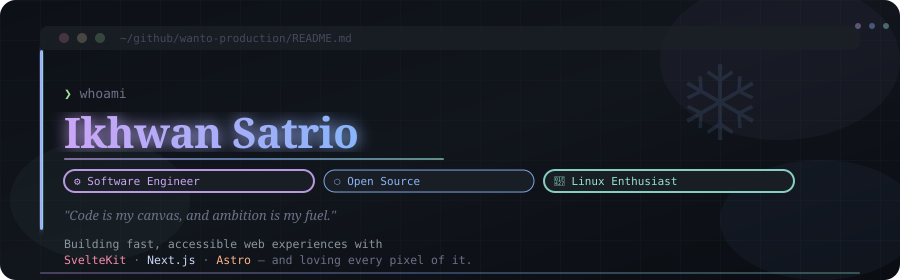
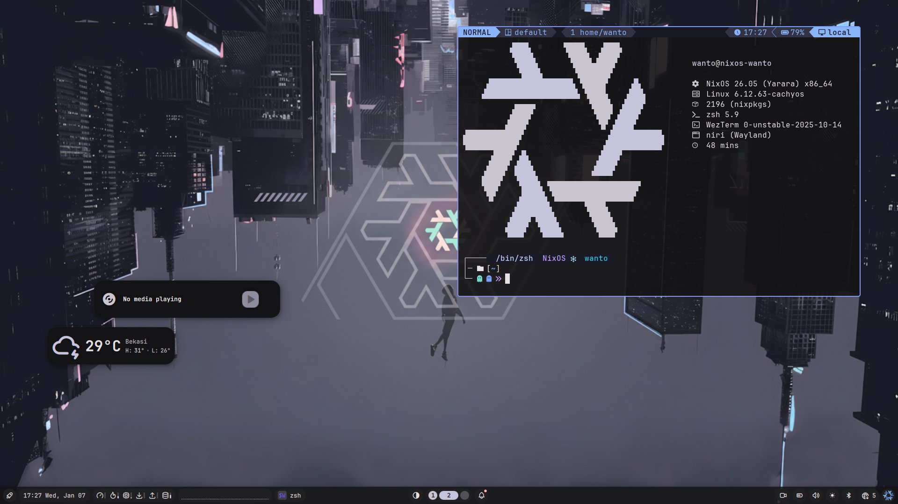

  

## 🐧 Linux Journey
A passionate Linux enthusiast who has explored multiple distributions:
**Ubuntu** → **Debian** → **Arch** → **NixOS** (main)

---

## 🚀 Tech Stack

### 🖥️ Languages

### ⚙️ Frameworks

### 🛠️ Tools

### 🌐 Other Interests
- Web performance & Core Web Vitals  
- Static site generation (SSG) & edge rendering  
- CLI tools & developer experience (DX)  
- Open-source contributions

---

## 📫 Let's Connect!

---

## 🌱 Currently
- Building performant web apps with **SvelteKit**
- Exploring **Rust** for WASM and tooling
- Contributing to open-source projects
- Writing technical notes on [my portfolio](https://portofolio-wanto.vercel.app)
- focus on working on the [myuanggwe](https://myuanggwe.vercel.app) project

---

> 💡 **Fun fact**: I believe the best code is not just functional — it’s **readable, maintainable, and kind** to the next developer.

---

✨ **Thanks for stopping by!** Feel free to explore my repos, open an issue, or just say hello! 💌
